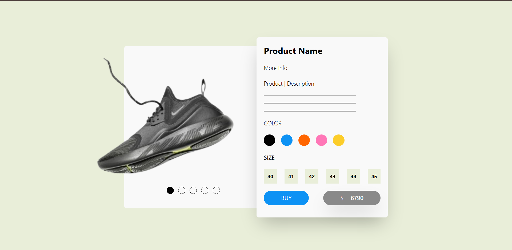
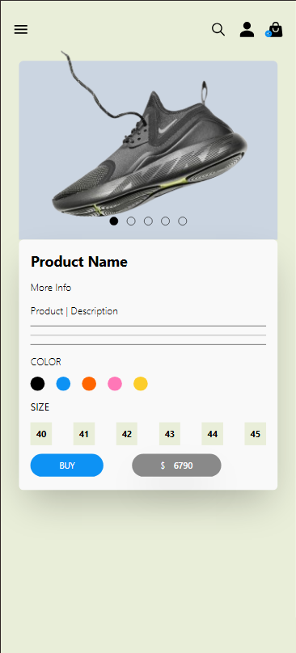

# Nike Shoes Products Page - React Project

This repo is a simple [React](https://react.dev/) project which showcases the different concepts on react. Among the basics of React are JSX, Props, States and Events. States are among the many react Hooks which allow data management.React `useState` hook should be handled locally before going global. Other React hooks are `useRef`,`useReducer`,`useContext`,`useId`

## Table of Contents

- [Overview](#overview)
- [Technologies Used](#technologies-used)
- [Basic React Concepts](#basic-react-concepts)
  - [Components](#components)
  - [JSX](#jsx)
  - [Props](#props)
  - [State](#state)
  - [Events](#events)
- [Styling with Tailwind CSS](#styling-with-tailwind-css)
- [Bonus Showcase: Nike Shoes Products Page](#bonus-showcase-nike-shoes-products-page)
  - [Key Features](#key-features)
  - [Example Product Card](#example-product-card)
- [Getting Started](#getting-started)
- [Running the Project](#running-the-project)
- [License](#license)

## Overview

This project showcases a responsive products page for Nike shoes, developed using React and styled with Tailwind CSS. It aims to illustrate fundamental React concepts such as components, props, state management, and event handling.

## Technologies Used

- **React**: A JavaScript library for building user interfaces.
- **Tailwind CSS**: A utility-first CSS framework for rapid UI development.
- **Vite**: A build tool that provides a faster and leaner development experience for modern web projects.
- **JavaScript**: The programming language used to build the application.

## Basic React Concepts

### Components

React applications are built using components, which are reusable pieces of the UI. Components can be functional or class-based. This project primarily uses functional components for their simplicity and ease of use.

```jsx
const Welcome = () => {
  return <h1>Welcome to the Nike Shoes Store!</h1>;
};
```

#### Web View



#### Mobile View


