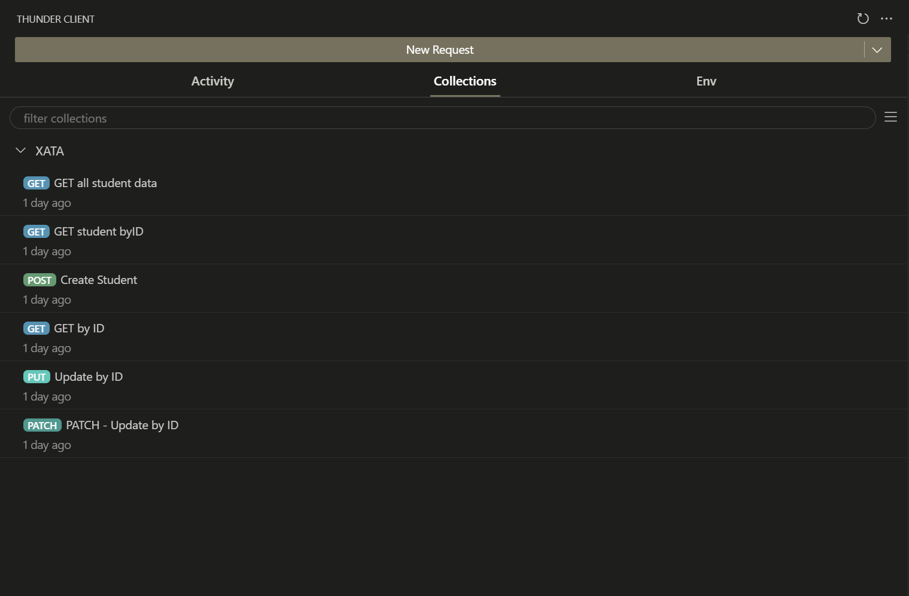
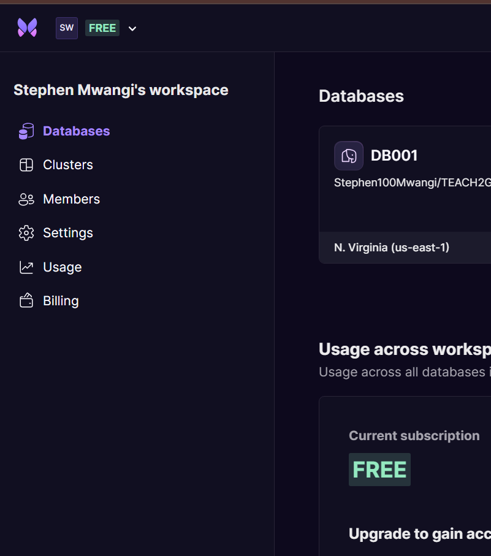
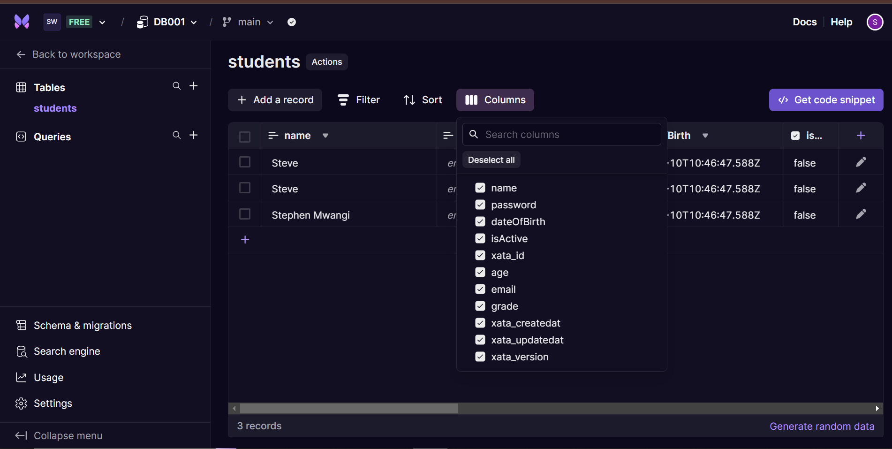

# Intro

This project showcases a CRUD operations. CRUD operations allow one to manipulate data in a database. CRUD operations stand for

1. Create
2. Read
3. Update
4. Delete

To perform CRUD operations, http - Hypertext Transfer Protocol provides different ways of handling data. This different ways are called http methods.

1. POST - HTTP method used to add data to the database. Data is added in key-value pairs. In order to successfully add data to the database, one must set Express to use certain middlewares. These middlewares are meant to let express allow the format in which the user sends data. These middlewares are `express.json()` and `express.urlencoded()`

`import express from 'express'`
`const app = express();`
`app.use(express.json());`
`app.use(express.urlencoded({extended=true;}))`
2. PUT - HTTP method used to update data in the database. This method is used to update the entire object in a database. If a give property is not passed, the data in the database - for that particular key will be reset or removed depending on the server.
3. PATCH - HTTP method used to update data in the database. This method is used to update the data partially. If a give property is not passed, the data in the database - for that particular key will remains the same. It updates data for only the keys that were passed
4. GET - HTTP method used to fetch data from the database. This method can fetch all the data in the database or even data for a particular object based on the id of the object.
5. DELETE -  HTTP method used to delete data from the database. This method is used to delete data for a particular object based on the id of the object.

This are the most common althoUgh there are other methods such as HEAD

To test our endpoints we will use Thunder client. You may decide to use Postman as an alternative. For a cleaner layout, you may arrange your request inside a collection.

## Thunder Client



For this particular project, we will use a mock database XATA [text](https://app.xata.io/workspaces/Stephen-Mwangi-s-workspace-de3k82)
Our database is called `DB001`


Inside our `DB001` database, we have a table called `students`.This is where we will add data for  our students.The students table has several columns


## Getting started with Xata

To get started, navigate to Xata, create a database, which you will configure with your Github repo.Once done, create a table and initialize your columns indicating the desired data types you will allow for each column.The table can be empty at first.
Navigate to VS Code and run these commands on the integrated terminal of your project
```npm install @xata.io/cli -g```
```xata init --db https://Stephen-Mwangi-s-workspace-de3k82.us-east-1.xata.sh/db/DB001```
